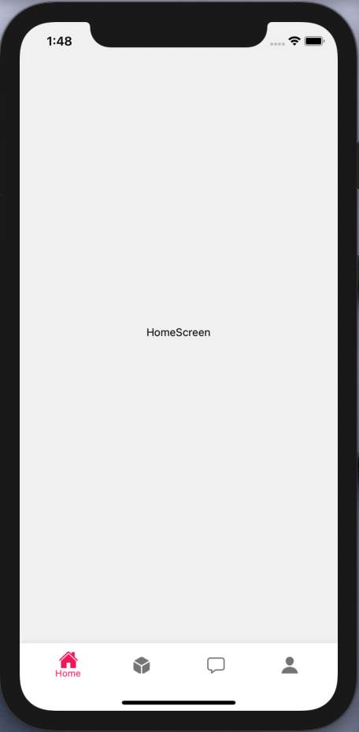

[<h1 align="center"></h1>](https://invoiss.com)

<div align="center">
<h1>Welcome to the Invoiss React-Native Interview Question</h1> 
</div> 

## Installation

<div align="center">
  
Make sure your environment is set up correctly according to the [React Native Set-Up Docs](https://reactnative.dev/docs/environment-setup) 
before you attend the interview question
</div> 


<p>Clone the repo by running this : </p>

```bash
git clone https://github.com/invoiss/InvoissInterviewApp.git
```

<p>cd in the project folder and :  </p>

```bash
npm install
```
<p>cd in ios folder and run :  </p>

```bash
pod install
```

<p>cd back to root project and run :  </p>

```bash
npx react-native run-ios
```


<h3 align="center">
You should be able to see this App Screen once your app is loaded on iOS Simulator. </br></br>

</h3>

## Your Task, Choose Between Option A , Option B, or Option C

<h1>Option A, Horrizontal Scrolling Effect </h1>
- Create this feature below within the given boiler plate app.
  *Note:* if the gif below doesnt load correctly, try this link for the full demo video : [Demo Video](https://reactnative.dev/docs/environment-setup)
  <h1 align="center"></h1>

<h4> Create this feature in the "Home" Screen of the boilerplate App. </h4>
- Your task is to a create a custom horizontally scrolling category section so that as the user scrolls down the page, then the categories on the top also scroll   horizontally and shift over. create this feature using a map/filter and not a FlatList. User should also be able to click on any of these categories and the     page should scroll down to that section. 
- You may use the Reanimated API V2.


<h1>Option B, Document Uploading </h1>

<h2>The second part of your interview is to create an document/image/video attachment feature.</h2>
- Add a button that pops a modal which asks the user what kind of document they would like to upload, they can choose a picture, or video from their gallary, and   upload it to the empty screen. 


<h1>Option B, Document Uploading </h1>


<div align="center">
<h2>Once you are done, create a pull request to this repo and we will take it from there! </h2> 
Thanks for applying to Invoiss!
</div> 


